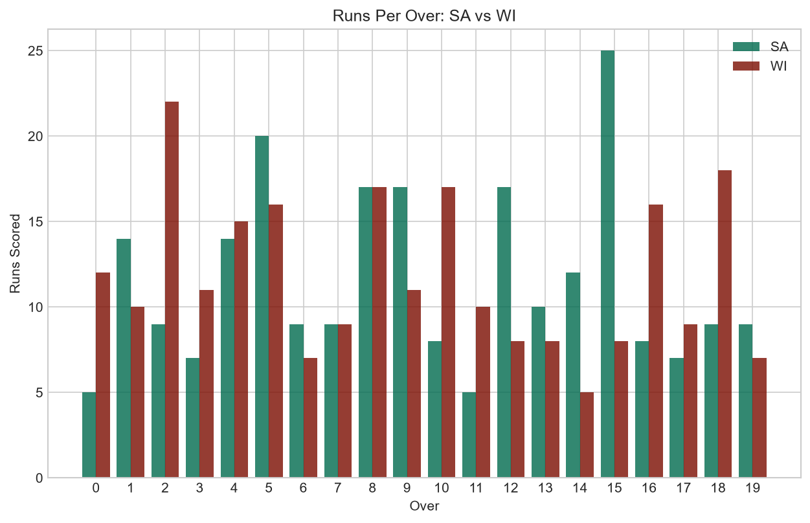
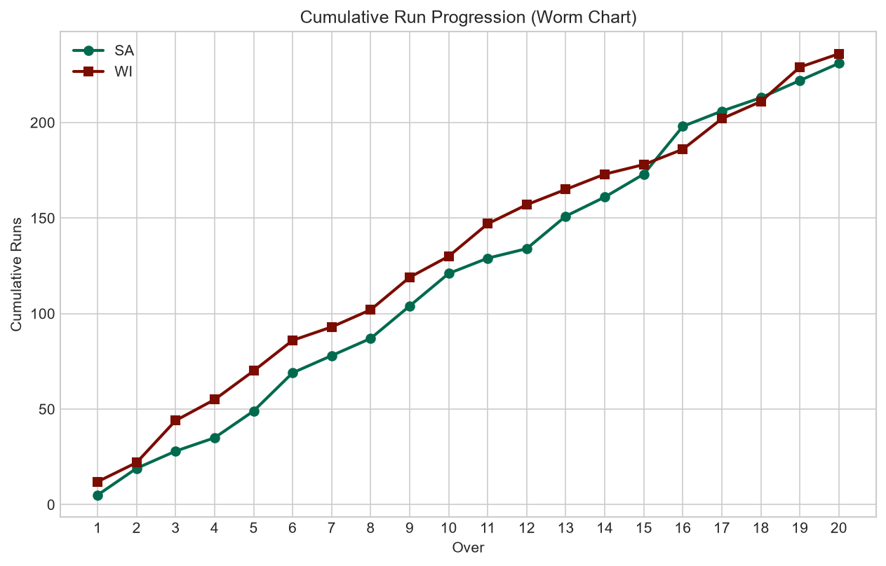
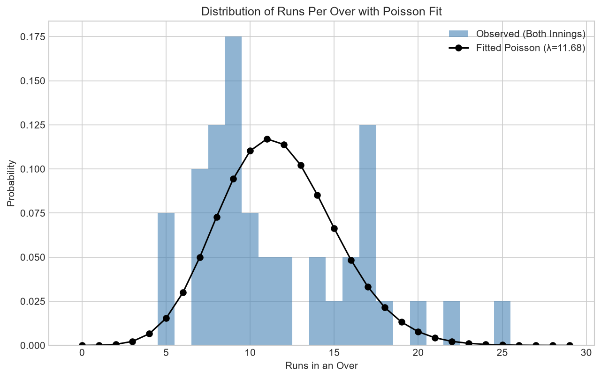
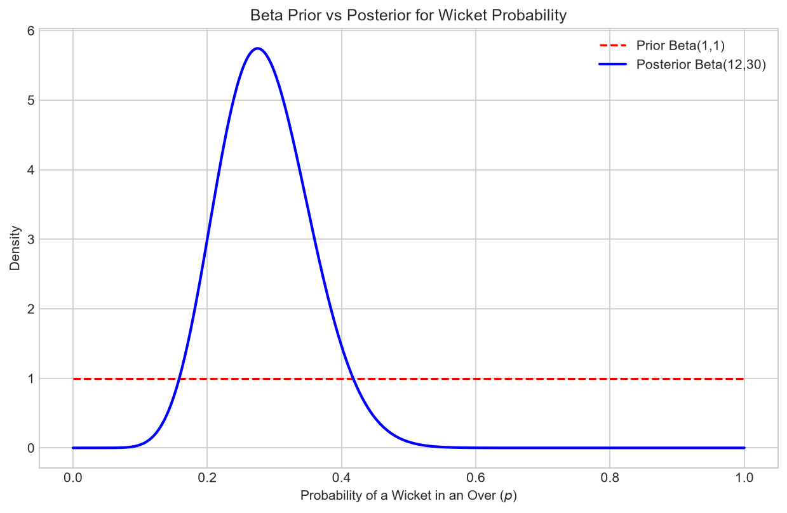
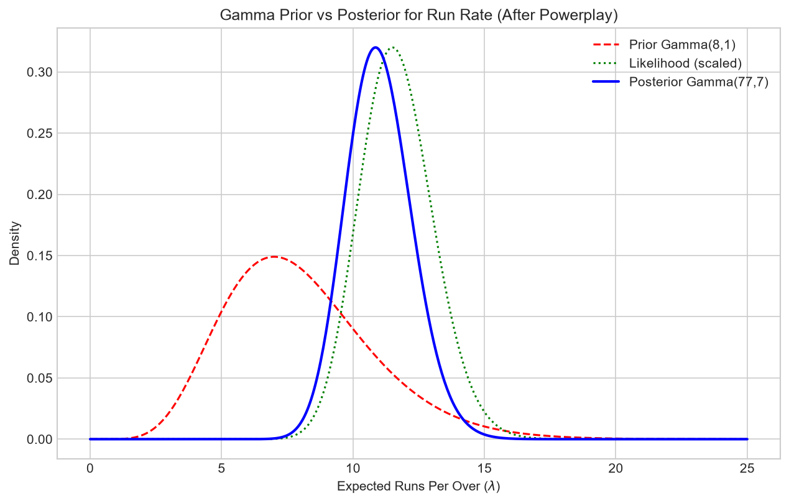
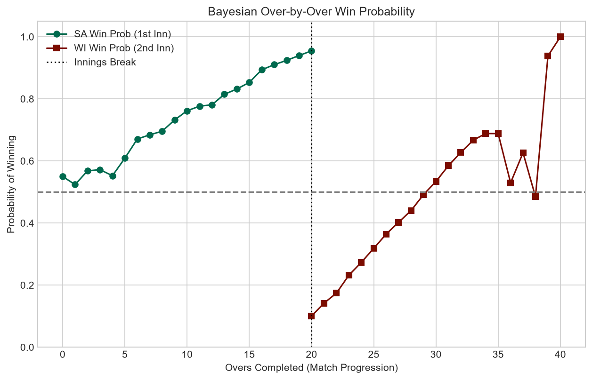
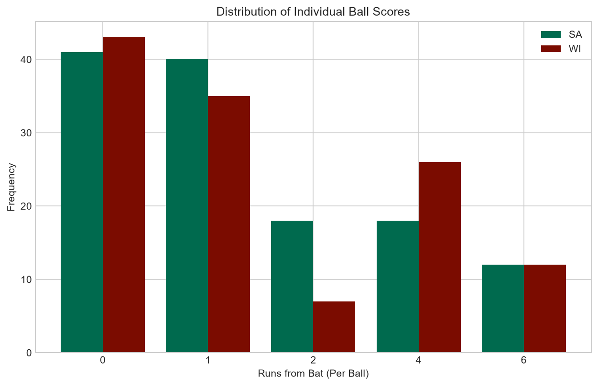
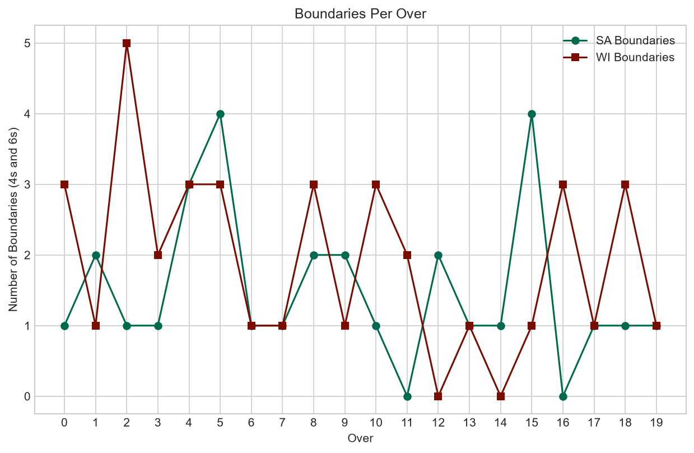

# Bayesian Analysis of a T20 Cricket Match 🏏📊

> **Project:** The Mathematics of a Cricket Match — Bayesian Statistics  
> **Match:** South Africa vs West Indies, 2nd T20I, Johannesburg, 11 January 2015  
> **Result:** West Indies won by 4 wickets (SA 231/7 • WI 236/6 in 19.2 overs)

## 📋 Overview

This project applies **Bayesian statistical methods** to real ball-by-ball T20 cricket data, demonstrating:

- **Poisson modelling** for runs-per-over distribution
- **Beta-Binomial** conjugate model for wicket probability
- **Gamma-Poisson** conjugate model for expected run rate
- **Sequential Bayesian updating** of win probability over-by-over

## 🔢 Key Results

| Analysis | Model | Result |
|---|---|---|
| Mean runs/over | Poisson MLE | λ = 11.68 |
| P(Score > 180) | Poisson CDF | 99.98% |
| P(Wicket in an over) | Beta(12, 30) posterior | 28.6% |
| Expected run rate (post-powerplay) | Gamma(77, 7) posterior | 11.00 runs/over |
| SA win prob after 10 overs | Logistic-Bayesian | 76.2% |
| WI win prob after 10 overs | Logistic-Bayesian | 53.4% |

## 📊 Visualisations

### Runs Per Over Comparison


### Cumulative Run Progression (Worm Chart)


### Poisson Distribution Fit


### Bayesian Wicket Probability (Beta Prior → Posterior)


### Expected Run Rate (Gamma-Poisson Conjugate)


### ⭐ Bayesian Win Probability — Over-by-Over Updating


### Individual Ball Score Distribution


### Boundary Analysis Per Over


## 🛠️ Tech Stack

- **Python 3.x**
- `numpy`, `scipy` — Statistical computations & distributions
- `pandas` — Data wrangling
- `matplotlib` — Publication-quality visualisations

## 🚀 Usage

```bash
# Clone the repo
git clone https://github.com/YOUR_USERNAME/bayesian-t20-cricket.git
cd bayesian-t20-cricket

# Install dependencies
pip install numpy scipy pandas matplotlib

# Run the analysis
python bayesian_cricket_analysis.py
```

All 8 figures will be generated in the `figures/` directory.

## 📁 Project Structure

```
├── 722337.json                     # Ball-by-ball match data (Cricsheet)
├── bayesian_cricket_analysis.py    # Complete analysis script
├── README.md                       # This file
└── figures/                        # Generated visualisations
    ├── fig1_runs_per_over.png
    ├── fig2_cumulative_runs.png
    ├── fig3_poisson_fit.png
    ├── fig4_wicket_probability_posterior.png
    ├── fig5_expected_runs_posterior.png
    ├── fig6_win_probability_updating.png
    ├── fig7_scoring_distribution.png
    └── fig8_boundary_analysis.png
```

## 📖 References

1. Gelman, A. et al. (2013). *Bayesian Data Analysis* (3rd ed.). CRC Press.
2. Duckworth, F. C. & Lewis, A. J. (1998). A fair method for resetting the target in interrupted one-day cricket matches.
3. Cricsheet.org — Ball-by-ball data (CC BY 4.0).

## 📄 License

This project is for academic purposes. Match data sourced from [Cricsheet](https://cricsheet.org/) under CC BY 4.0.
